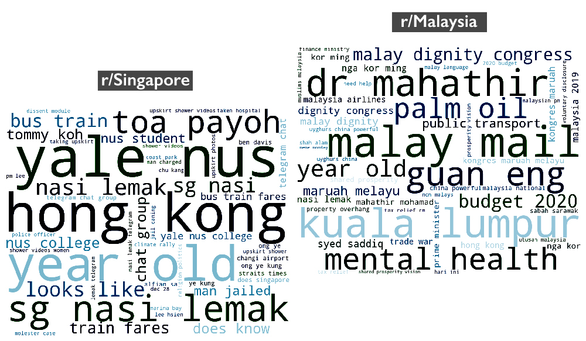

### Project 3 - Subreddit Classification
---
Reddit is a social news, content, and discussions website. Posts are organised according to subject into user-created 'subreddits'. Members submit content (such as images, texts, and links) to subreddits, which can then be voted up ('upvote') or down ('downvote') by other members.

In this project, I examined posts from two subreddits - [**r/Singapore**](https://www.reddit.com/r/singapore/) and [**r/Malaysia**](https://www.reddit.com/r/malaysia/). Despite their shared heritage and history (Singapore was part of Malaysia until her separation and independence on 9 August 1965 [[1]](http://eresources.nlb.gov.sg/history/events/dc1efe7a-8159-40b2-9244-cdb078755013)), Singapore has taken on a very different development path since independence. On the surface, the two countries seem very different today - different languages, different racial and religious compositions, etc. However, their citizens may have more in common than people from both countries usually like to admit. The goal of this project is therefore to try and figure out how similar Singaporeans and Malaysians are, by looking at what they talk about on their subreddits. 

### Summary of Findings & Recommendations
---

(The most common phrases on r/Singapore and r/Malaysia, from 23 September to 22 October 2019.)

To answer these questions, I developed a word-frequency based classification model to predict the subreddit that a random post belongs to. A variety of preliminary models were tested and evaluated based on prediction accuracy, i.e. how many posts they were able to correctly classify. The final production model was a multinomial naive Bayes classifier that makes predictions based on title content and post lengths, with an accuracy of 71%. This shows that the posts in r/Malaysia and r/Singapore are fairly different, but still have a good amount of similarities. The differences may mainly be due to differences in current affairs in Singapore and Malaysia. It is therefore not surprising that the two subreddits are somewhat distinguishable from each other, as the current affair topics in different countries will undoubtedly be different. The similarities behind the model misclassifications may be due to more generic, day-to-day topics such as people asking for help or life advice, which are likely to be similar between the two countries.

To further improve model accuracy, a bigger corpus that incorporates a bigger vocabulary on the current affairs in Singapore and Malaysia is needed. As news are constantly changing, new words are also constantly emerging in these subreddits. Therefore, it would not be enough to train the model on/obtain the training corpus from past subreddit posts. A more useful corpus for model training would be english new sites that report on both Singapore and Malaysia, such Channel News Asia.

Although the goal of this project is to classify subreddits, such a classification model can also be applied elsewhere, such as to automate CRM tasks based on topic matching, recommending similar articles to readers, and the ever-useful spam email filtering.

### Data Dictionary
---
The data used for this project are posts and comments from r/Singapore and r/Malaysia, from 23 Sep to 22 October 2019, obtained using the Reddit API.

|Feature|Type|Dataset|Description|
|---|---|---|---|
|title        |str      |sg_posts/ms_posts|title of each reddit post
|id           |str      |sg_posts/ms_posts|id of each reddit post
|date_created |datetime |sg_posts/ms_posts|date and time the post is created
|text         |str      |sg_posts/ms_posts|body text of each reddit post
|distinguished|str      |sg_posts/ms_posts|whether the post is created by a moderator of the subreddit
|score        |int      |sg_posts/ms_posts|number of upvotes a post has
|upvote_ratio |float    |sg_posts/ms_posts|number of upvotes a post has, divided by the total number of votes the post received
|post_id                 |str|sg_comments/ms_comments|id of the parent post of a comment
|comment_text            |str|sg_comments/ms_comments|body text of each top level comment
|comment_distinguished   |str|sg_comments/ms_comments|whether the comment is made by a moderator of the subreddit
|comment_score           |int|sg_comments/ms_comments|number of upvotes a comment has
